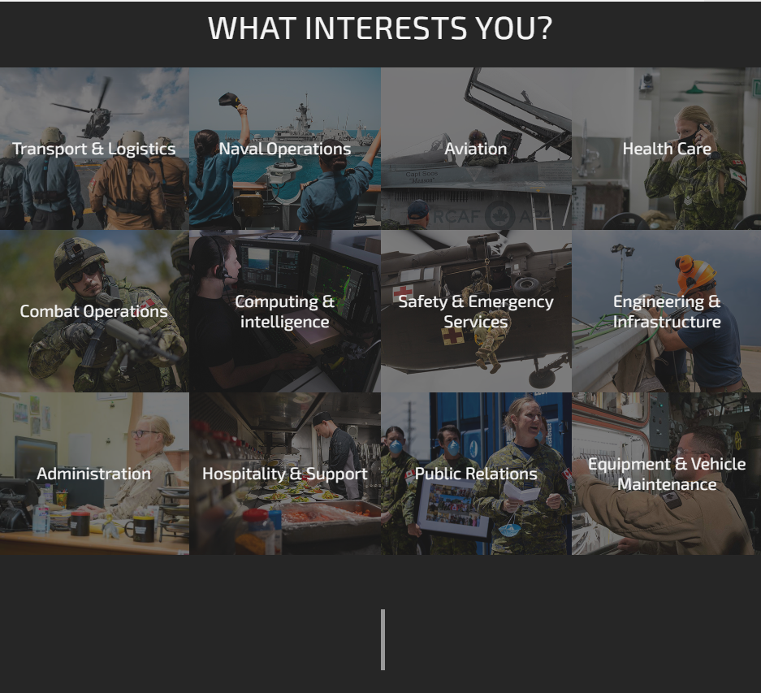
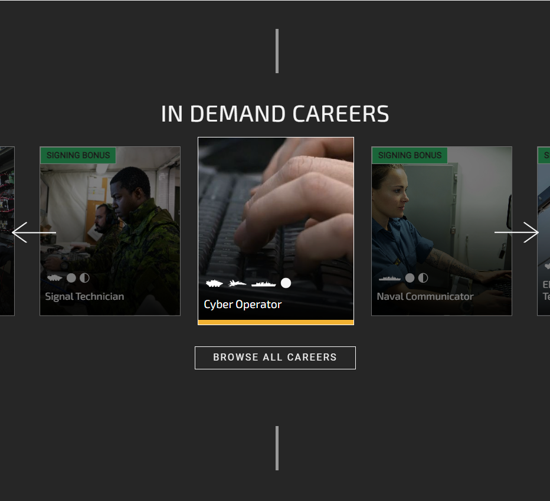

# Planning for cmhoc web rpg

## influences

### forces-style

sign up page?

maybe a recruitment site for public service

    leaning into this we could develop features like a cursus honorum
    start as an activist, volunteer and work your way up to mp and eventually PM

replace the soldier with a stock or AI image of an ethnically ambiguous woman in a pantsuit shaking hands with someone

replace govt of canada with canadian model house of commons

### ourcommons

muted and boring i think, but maybe more what cmhoc is about

maybe we can reconcile the two.

### current reddit

also boring and locks us into a posts-based ui

## stages

### stage 1

and a linktree thing to the cmhoc subs and discords

### stage two

and
lasy idea for now
an email newsletter
where leaders can send emails to their party
and general cmhoc emails for every1
cuz if i have that i am 283738% more likely to know whats going on and to debaye

persona, place where people can write info about their character

